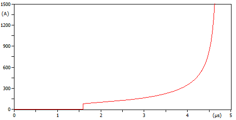

# Insulator Models

## Disruptive Effect (DE) Model

The accumulated disruptive effect is calculated as:

$$
DE(t)=\int_{t_0}^{t}\left[e(\tau)-V_0\right]^{k_{da}}\,d\tau,
\qquad e(\tau)>V_0
$$

When $e(\tau)\leq V_0$, the integrand is set to zero. Flashover occurs when
$DE(t)\geq DE_c$, where:

$$
DE_c=1.1506\,(CFO)^{k_{da}}.
$$

### Inputs and Units

| Input | Description | Unit supplied to MODELS |
|---|---|---|
| `v_node_1` | Instantaneous voltage at the first node | V |
| `v_node_2` | Instantaneous voltage at the second node | V |
| `V0` | Voltage threshold at which DE integration starts | kV |
| `CFO` | Critical Flashover Voltage | kV |
| `kda` | DE model exponent | dimensionless |

The model calculates $e(t)=|v_{node\_1}-v_{node\_2}|$ and internally converts
the voltage from V to kV. Since ATP uses seconds as its time unit, time is also
converted internally to microseconds. Therefore, $DE$ and $DE_c$ are expressed
in $\mathrm{kV}^{k_{da}}\,\mu\mathrm{s}$.

The `flashover` output is dimensionless. Its value is 0 before breakdown and 1
after breakdown. The output remains latched at 1 and can be connected to a TACS
switch closing command.

## Leader Progression Model (LPM) - Wang et al.

A comprehensive study evaluated the performance of insulators subjected to short-tail lightning impulse voltage waveforms [1]. The study covered insulators in the 110 to 500 kV range, and the model was implemented in PSCAD for validation.

### Streamer Development

The streamer development time is calculated based on the average voltage across the gap. The streamer propagation is completed when:

$$
\frac{1}{T_s} \int_{t=0}^{T_s} U(t) \, dt > c_1 \cdot d + c_3
$$

where:
- $T_s$ is the streamer development time (s)
- $U(t)$ is the instantaneous voltage across the gap (kV)
- $d$ is the insulator string length (m)
- $c_1$ and $c_3$ are constants that depend on the insulator type and impulse polarity

### Streamer Development Constants

| Category | $c_1$ (kV/m) | $c_3$ (kV) |
|---|---|---|
| Composite insulator, negative impulse | 500 | 140 |
| Composite insulator, positive impulse | 360 | 290 |
| Porcelain insulator, negative impulse | 490 | 90 |
| Porcelain insulator, positive impulse | 430 | 190 |

### Leader Development Velocity

The leader velocity depends on the type of insulator used:

$$
\frac{dl}{dt} = k_6 \cdot \left[ \frac{U(t)}{w} - E_0 \right]
$$

where $w = d - l$ for porcelain (disc) insulators and $w = d - 2l$ for composite (polymeric) insulators. The constants $k_6$ and $E_0$ are given in the table below. The leader current is given by the corresponding equation in the reference.

| Category | $k_6$ (m²/(kV·10³s)) | $E_0$ (kV/m) |
|---|---|---|
| Composite insulator, negative impulse | 1.3 | 570 |
| Composite insulator, positive impulse | 1.5 | 620 |
| Porcelain insulator, negative impulse | 2.5 | 640 |
| Porcelain insulator, positive impulse | 2.9 | 580 |

### Current over the insulation
The current during the leader development can be evaluated as:

$$
v_L=k_0\left(\frac{U(t)}{d-x}-E_0\right),
\qquad q=500\,\mu\mathrm{C/m}
$$

$$
i(t)=qv_L(t)=q\frac{dx}{dt}.
$$

Here, $q$ is the average charge per unit length of the leader. At folder teste (meaning test in english) a zoom in the current can be viewed before the flashover:

### ATP 
Different from DE model, this model was implemented as a Thevenin model at ATP (TYPE94), the user only follow these steps at ATPdraw:
Right Bottom -> Models -> Type94 -> THEV and edit the file using wang.mod

The model was compared with [2], called LDM.

---

## References

[1] X. Wang, Z. Yu, and J. He, "Breakdown Process Experiments of 110- to 500-kV Insulator Strings Under Short Tail Lightning Impulse," *IEEE Transactions on Power Delivery*, vol. 29, no. 5, pp. 2394-2401, Oct. 2014. doi: 10.1109/TPWRD.2014.2306688.

[2] Z. G. Datsios and P. N. Mikropoulos, "Implementation of Leader Development
Models in ATP-EMTP Using a Type-94 Circuit Component," in *Proc. 2014
International Conference on Lightning Protection (ICLP)*, Shanghai, China,
pp. 979-984, Oct. 2014.
